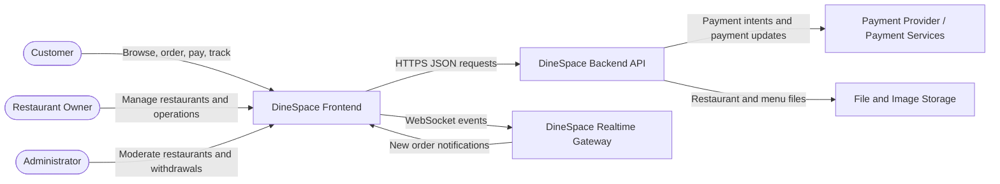
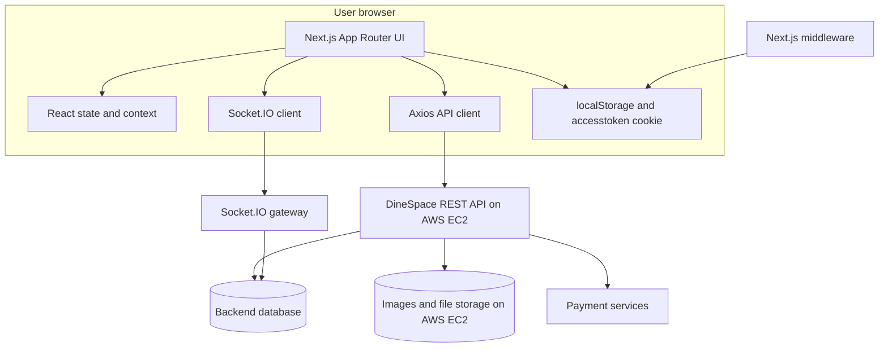
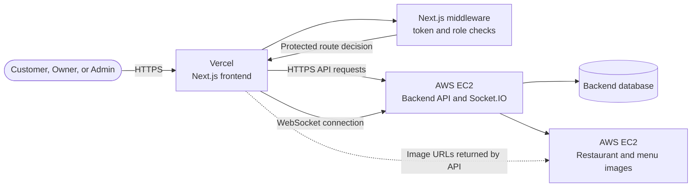
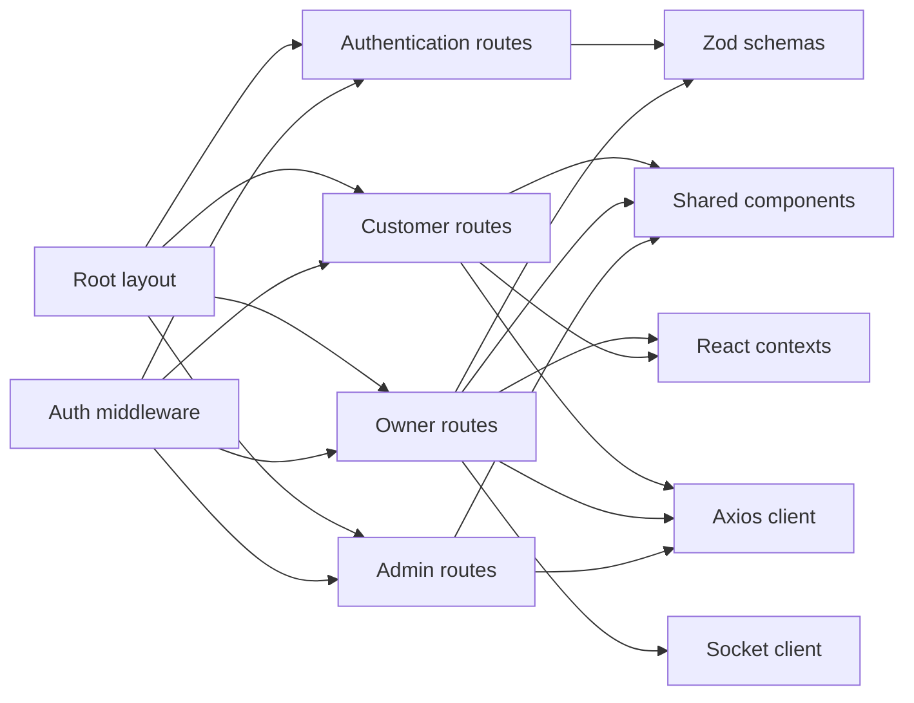
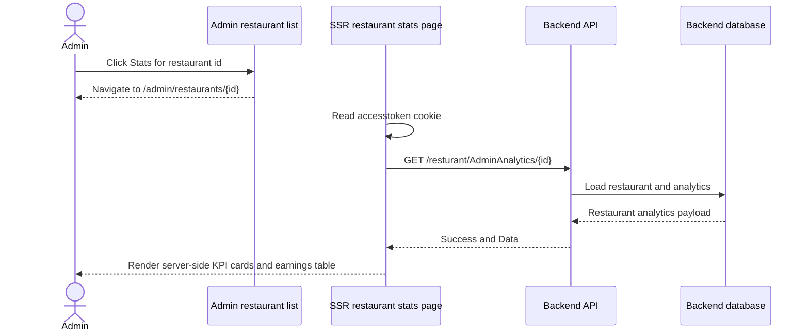
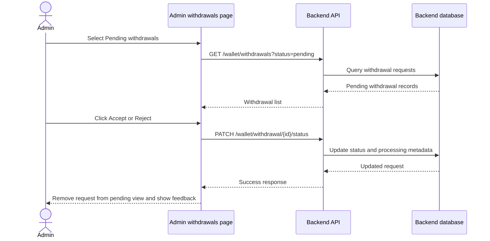
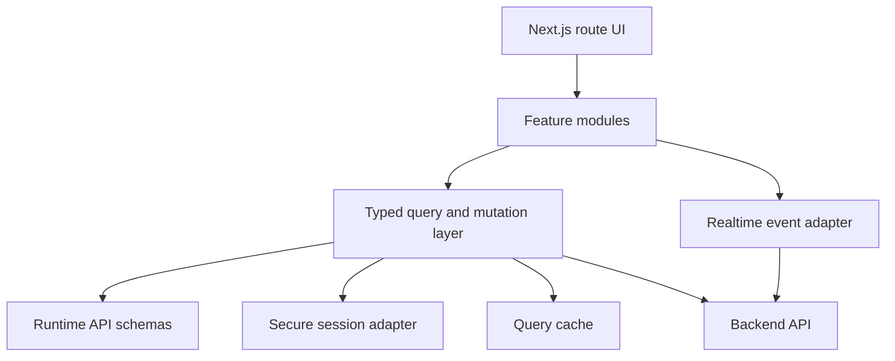

# DineSpace Frontend - Project Report

## 1. Executive summary

DineSpace is a restaurant management and food-ordering frontend built with Next.js App Router, React, TypeScript, Tailwind CSS, DaisyUI, Axios, Socket.IO, and Zod. The application supports three primary user experiences:

1. **Customers** browse restaurants, menus, and restaurant details; create orders; make payments; track orders; and view order history.
2. **Restaurant owners** manage one or more restaurants, menus, tables, orders, payments, wallets, refunds, and withdrawal requests.
3. **Administrators** manage restaurants, review withdrawal requests, and inspect restaurant analytics, including revenue, profit, order counts, refunds, and monthly earnings.

The frontend is deployed on **Vercel** and communicates with the backend hosted on an **AWS EC2 instance**. The EC2 deployment provides the REST API, Socket.IO gateway, and restaurant/menu image hosting. The frontend API base URL is controlled by the `NEXT_PUBLIC_API_URL` environment variable. The source code retains `http://localhost:3001` only as a local-development fallback.

## 2. Project scope

### Included

- Authentication and email-verification request flow
- JWT-based route protection
- Customer restaurant discovery
- Restaurant detail and menu browsing
- Checkout and payment initiation
- Customer order history and order tracking
- Owner restaurant switching
- Owner dashboard and live orders
- Menu and category management
- Table management and table-state updates
- Payment and refund views
- Wallet balance and withdrawal requests
- Admin restaurant management
- Admin withdrawal approval/rejection
- Server-rendered admin restaurant analytics pages
- Responsive, theme-consistent UI components

### Not included in this repository

- Backend controllers, services, database schema, migrations, and payment-provider implementation
- Backend Socket.IO server implementation
- Infrastructure manifests such as Docker, Kubernetes, or Terraform
- Automated unit, integration, or end-to-end test suites
- A complete production deployment pipeline

## 3. Technology stack

| Area | Technology |
|---|---|
| Framework | Next.js 16.3 App Router |
| UI runtime | React 19 |
| Language | TypeScript |
| Styling | Tailwind CSS 4, DaisyUI |
| HTTP client | Axios |
| Real-time communication | Socket.IO client |
| Forms | React Hook Form |
| Validation | Zod and `@hookform/resolvers` |
| Icons | Lucide React, React Icons, Font Awesome |
| Animation | Motion |
| Loading UI | React Loader Spinner |
| Analytics | Vercel Analytics |
| Code quality | ESLint, Next.js TypeScript rules |
| Build tooling | Next.js, PostCSS, TypeScript |

### Runtime dependencies

The dependency manifest is maintained in [package.json](./package.json). The project uses:

- `next`, `react`, and `react-dom`
- `axios`
- `socket.io-client`
- `react-hook-form`, `zod`, and `@hookform/resolvers`
- `tailwindcss`, `@tailwindcss/postcss`, and `daisyui`
- `lucide-react`, Font Awesome packages, and React Icons
- `@vercel/analytics`

## 4. Repository structure

```text
DineSpace_Frontend/
├── public/                       # Static images, logos, and public assets
├── src/
│   ├── app/                      # Next.js App Router routes and layouts
│   │   ├── admin/                # Administrator routes
│   │   ├── auth/                 # Login and verification
│   │   ├── home/                 # Restaurant-owner portal
│   │   ├── registration/         # Restaurant registration flow
│   │   ├── user/                 # Customer-facing routes
│   │   ├── globals.css           # Global theme and Tailwind entrypoint
│   │   └── layout.tsx            # Root layout and metadata
│   ├── components/               # Shared and feature-specific components
│   ├── lib/
│   │   ├── api/                  # Axios client and interceptors
│   │   ├── algorithms/           # Small reusable application algorithms
│   │   ├── context/              # React context contracts
│   │   ├── interfaces/           # Domain TypeScript interfaces
│   │   └── websock/              # Socket.IO client configuration
│   ├── schemas/                  # Zod form schemas
│   ├── types/                    # Type declarations
│   └── middleware.ts             # Authentication and role routing
├── .vscode/                      # Workspace launch and extension settings
├── next.config.ts                # Next.js configuration
├── package.json                  # Scripts and dependencies
├── tsconfig.json                 # TypeScript configuration
├── eslint.config.mjs             # ESLint configuration
└── PROJECT_REPORT.md             # This report
```

## 5. C4 architecture diagrams

The diagrams below use Mermaid. They can be rendered by GitHub, many Markdown viewers, and Mermaid-compatible documentation tools.

### 5.1 C4 level 1 - System context



### 5.2 C4 level 2 - Container view



### 5.3 Deployment topology



In this deployment model:

- Vercel builds and serves the Next.js frontend.
- AWS EC2 runs the backend API and real-time Socket.IO service.
- AWS EC2 stores or serves restaurant and menu images.
- `NEXT_PUBLIC_API_URL` points the Vercel deployment to the EC2 API URL.
- Next.js middleware automatically checks the `accesstoken` cookie, validates token expiry, determines the user role, and restricts `/admin` and `/home` route groups.

### 5.4 C4 level 3 - Frontend component view



### 5.5 Restaurant analytics request sequence



### 5.6 Withdrawal approval sequence



## 6. Application routes

### Public and authentication routes

| Route | Purpose |
|---|---|
| `/` | Public landing route |
| `/auth` | Login and email verification request |
| `/registration/[id]` | Restaurant registration flow |

### Customer routes

| Route | Purpose |
|---|---|
| `/user` | Restaurant discovery |
| `/user/Resturant/[id]` | Restaurant details and menu |
| `/user/checkout/[id]` | Checkout and payment initiation |
| `/user/myBowl` | Current basket |
| `/user/myorders` | Customer order lookup/history |
| `/user/myorders/[id]` | Individual order details |

### Restaurant-owner routes

| Route | Purpose |
|---|---|
| `/home` | Owner dashboard |
| `/home/restaurants` | Create and manage owned restaurants |
| `/home/menu` | Menu list and availability |
| `/home/menu/addMenu` | Add menu item |
| `/home/menu/edit/[id]` | Edit menu item |
| `/home/tables` | Table management |
| `/home/orders` | Paginated order management |
| `/home/bookings` | Booking area |
| `/home/payments` | Payment and refund history |
| `/home/wallet` | Wallet, balance, and withdrawals |
| `/home/notifications` | Notifications area |

### Administrator routes

| Route | Purpose |
|---|---|
| `/admin` | Redirects to the admin restaurant list |
| `/admin/restaurants` | Restaurant administration table |
| `/admin/restaurants/[id]` | Server-rendered restaurant analytics |
| `/admin/withdrawals` | Withdrawal review and approval/rejection |

## 7. Functional capabilities

### 7.1 Authentication and authorization

- Login uses `auth/login`.
- The response token is stored in both `localStorage` and an `accesstoken` cookie.
- Middleware reads the cookie, decodes the JWT, checks expiration, and applies role-based route prefixes.
- Admin users are routed to `/admin`.
- Owner users are routed to `/home`.
- Unauthenticated users are redirected to `/auth`.
- Unauthorized roles are redirected to `/unauthorized`.
- Login form validation enforces email format and password complexity.

### 7.2 Customer experience

- Fetches available restaurants.
- Displays restaurant details and menu items.
- Supports menu category browsing and bowl/cart interactions.
- Loads restaurant data before checkout.
- Supports payment intent and fallback/fake payment flows used by the application.
- Shows order history and order detail pages.
- Uses status polling/lookup endpoints for order tracking.

### 7.3 Owner experience

- Fetches the current owner and owned restaurants.
- Persists the selected restaurant in local storage.
- Provides restaurant switching through owner navigation.
- Establishes a Socket.IO subscription for the selected restaurant.
- Refreshes order data when `newOrder` events arrive.
- Manages menu items, categories, availability, and deletion.
- Manages tables and transitions between available, occupied, reserved, and cleaning states.
- Updates order statuses.
- Displays payments and supports refund initiation.
- Shows wallet balance and completed/pending withdrawals.
- Validates withdrawal amount, payment method, account number, and minimum amount.

### 7.4 Administrator experience

- Loads all restaurants into a searchable table.
- Shows restaurant contact, address, and active/banned status.
- Provides a public-facing Visit Restaurant link.
- Provides a Stats link containing the restaurant ID.
- Server-renders per-restaurant admin analytics.
- Displays revenue, profit, order totals, order-state counts, average values, and monthly earnings.
- Loads withdrawal requests by status.
- Allows Accept and Reject operations through the status-specific endpoint.
- Retains the search bar for withdrawal ID, restaurant, account, payment method, and status.

## 8. API integration inventory

The frontend uses the Axios instance in [src/lib/api/axios.tsx](./src/lib/api/axios.tsx). It applies the API base URL and, in the browser, attaches the `accesstoken` local-storage token as a Bearer token.

| Area | Endpoint examples | Methods |
|---|---|---|
| Authentication | `auth/login`, `auth/Verifyemail`, `auth/register/{id}` | POST |
| User | `user/Getme` | GET |
| Restaurants | `resturant/getAllResturants`, `resturant/getResturentById/{id}` | GET |
| Restaurant management | `resturant/getMyresturants`, `resturant/CreateResturant`, `resturant/UpdateResturant`, `resturant/DeleteResturant/{id}` | GET, POST, PATCH, DELETE |
| Analytics | `resturant/AdminAnalytics/{id}` | GET |
| Menus | `menu/GetMenu/{restaurantId}`, `menu/GetMenuItem/{id}`, `menu/CreateMenu`, `menu/UpdateMenu`, `menu/DeleteMenuItem/{id}`, `menu/toggleAvailabel/{id}` | GET, POST, PATCH, DELETE |
| Categories | `menu/GetCategories` | GET |
| Orders | `order/PlaceOrder`, `order/GetallOrders/{restaurantId}`, `order/GetOrderById/{id}`, `order/todaysOrders/{restaurantId}`, `order/updateOrders/`, `order/filterOrders/{restaurantId}` | GET, POST, PATCH |
| Add-ons | `order/PlaceAddOnOrder` | POST |
| Payments | `payment/updatePayment`, `payment/GetpaymentByResturentId/{id}`, `payment/monthly/{id}`, `wallet/refund/{paymentId}` | GET, POST, PATCH |
| Tables | `tables/getTablesByResturantId/{id}`, table-state endpoints | GET, POST, PATCH, DELETE |
| Wallet | `wallet/wallet/{restaurantId}`, `wallet/WidthdrawRequest/{restaurantId}`, `wallet/withdrawal/{id}` | GET, POST, DELETE |
| Withdrawals | `wallet/withdrawals?status={status}`, `wallet/withdrawal/{id}/status` | GET, PATCH |

> Endpoint spelling and capitalization follow the existing backend contract, including legacy names such as `resturant`, `WidthdrawRequest`, and `toggleAvailabel`.

## 9. Domain model summary

The main TypeScript contracts are in `src/lib/interfaces`.

### Restaurant

- Identity: `id`, `resturantName`
- Contact: `address`, `phone`, `resturantemail`
- Availability: `isopen`, `opening`, `closing`, `payfirst`
- Ownership: `ownerid`
- Moderation: `isBanned`
- Media: logo, cover, and file references
- Operational relations: menu items and tables

### Order

Orders contain restaurant and customer context, order items, payable amount, discount, payment, and an `OrderStatus` enum:

- `pending`
- `confirmed`
- `preparing`
- `ready`
- `completed`
- `canceled`
- `failed`

### Payment

Payment states include:

- `pending`
- `paid`
- `failed`
- `processingrefund`
- `refund`

### Wallet and withdrawal

Wallets contain balance and withdrawal requests. Withdrawal requests include:

- Amount
- Account number
- Payment method
- Status
- Request type
- Creation and processing timestamps
- Rejection reason
- Restaurant wallet and restaurant relation

Withdrawal states include `pending`, `approved`, `rejected`, and the existing `cancled` value.

## 10. State management and data flow

The application primarily uses local React state and scoped React contexts rather than a global state library.

### Contexts

- `adminContext`: popup and server-error setters for administrator screens.
- `resturantContext`: selected restaurant, owner popup/error handling, restaurant options, and order refresh counter.
- `userContext`: navigation state, user popup/error handling, and bowl contents.

### Persistence

- `accesstoken` is stored in local storage and a browser cookie.
- Selected owner restaurant is stored as `defaultres`.
- Owned restaurant options are stored as `resids`.

### Real-time flow

1. Owner layout obtains a selected restaurant.
2. Socket.IO authentication uses the stored access token.
3. The client connects and emits `subscribeRestaurant`.
4. The client listens for `newOrder`.
5. New order events increment a refresh counter consumed by owner views.

## 11. Security architecture

### Current controls

- JWT expiration is checked in middleware.
- Role prefixes are checked before protected route access.
- API requests attach a Bearer token in browser contexts.
- Server-rendered analytics reads the authentication cookie and forwards it to the backend.
- Forms use Zod validation for login, registration, menu, and withdrawal inputs.
- Protected route groups are covered by middleware matchers for `/home` and `/admin`.

### Security considerations

1. The access token is available to JavaScript through `localStorage`; an XSS vulnerability could expose it. A production backend/frontend design should prefer an HttpOnly, Secure, SameSite cookie.
2. Middleware currently logs token-related information during development. Production logging should never print tokens or sensitive authentication data.
3. Server-side fetches should validate the backend response shape before rendering if the API is not fully typed or stable.
4. Ban/unban, withdrawal approval, refunds, and order-status updates must be authorized on the backend; frontend controls are not security boundaries.
5. The EC2 API URL should be supplied to Vercel through `NEXT_PUBLIC_API_URL`; production deployment values should not be committed to the repository.
6. API errors should be normalized at the client boundary so user-facing messages do not expose backend internals.

## 12. UI and design system

The visual language uses:

- Warm off-white background: `#FBF9F6`
- Primary terracotta: `#A13924`
- Border beige: `#DEC0BA`
- Secondary text: `#646468`
- Positive state: `#188260`
- Soft panel background: `#F5F3F0`

Common UI patterns include:

- Rounded cards with subtle borders and shadows
- Responsive overflow containers for tables
- Search fields above list views
- Status pills for active, banned, pending, approved, and rejected states
- Shared popup and server-error overlays
- Fixed role-specific navigation
- Lucide icons for actions and summary cards

## 13. Rendering strategy

The codebase uses both rendering modes:

### Client-rendered areas

Most interactive owner, customer, and list-management screens use `"use client"` because they need:

- React state
- Context
- Browser storage
- Form handlers
- Live Socket.IO events
- Immediate optimistic or interactive UI updates

### Server-rendered areas

The admin restaurant statistics route is a Server Component. It:

- Receives the dynamic restaurant ID from the route
- Reads the `accesstoken` cookie
- Fetches `AdminAnalytics/{id}` on the server
- Uses `cache: "no-store"` for current analytics
- Renders KPI and monthly-earnings markup on the server

## 14. Validation and quality checks

Available project scripts:

```bash
npm run dev
npm run build
npm run start
npm run lint
```

TypeScript is configured with strict mode and the Next.js TypeScript plugin. ESLint uses Next.js Core Web Vitals and TypeScript configurations.

Recommended validation sequence:

```bash
npm run lint
npm run build
```

The repository currently does not contain a dedicated test suite. Adding focused tests would be beneficial for:

- Authentication redirects and role routing
- Withdrawal status transitions
- Restaurant ban/unban behavior
- Analytics fallback handling
- Search filtering
- Checkout and payment error paths

## 15. Deployment model

### Current deployment topology

- **Frontend:** Vercel-hosted Next.js application
- **Backend:** AWS EC2-hosted REST API
- **Realtime:** Socket.IO service running with the backend on AWS EC2
- **Images:** Restaurant and menu images served from the AWS EC2 environment
- **Route protection:** Next.js middleware automatically checks authentication and role access before protected pages render
- **Configuration:** Vercel environment variable `NEXT_PUBLIC_API_URL` points to the EC2 backend

### Expected runtime and integration requirements

- Node.js environment capable of running Next.js 16 on Vercel
- Public HTTPS access from Vercel to the EC2 backend
- Socket.IO gateway reachable from browser clients
- EC2 backend configured with CORS for the Vercel frontend origin
- Cookie configuration compatible with the frontend and backend domains
- Correct Next.js image remote patterns for the EC2 image host
- EC2 security-group rules allowing the required HTTPS/API and WebSocket traffic

### Deployment checklist

1. Configure the EC2 security group and reverse proxy/firewall for HTTPS API and WebSocket traffic.
2. Confirm the EC2 backend and image service are reachable from the intended Vercel domains.
3. Configure backend CORS and credentials for the Vercel frontend origin.
4. Add `NEXT_PUBLIC_API_URL` to the Vercel project environment settings.
5. Confirm the authentication cookie domain, path, SameSite, and Secure settings.
6. Confirm the backend supports the exact endpoint casing used by the frontend.
7. Confirm Socket.IO transport and origin settings.
8. Install dependencies with `npm ci` during the Vercel build.
9. Run `npm run lint`.
10. Run `npm run build`.
11. Deploy through Vercel and verify the production deployment.
12. Validate login, middleware redirects, owner switching, customer checkout, live orders, withdrawals, images, and admin analytics.

## 16. Known technical debt and recommended improvements

### High priority

- Move authentication to an HttpOnly cookie where possible.
- Remove token and verbose request logging from production paths.
- Add response schemas or runtime validation for major API payloads.
- Add tests for critical financial operations: payments, refunds, wallet withdrawals, and approvals.
- Standardize API endpoint names in the backend and frontend.
- Add loading and error states to every server-rendered and client-rendered data view.

### Medium priority

- Extract repeated table, status-pill, and KPI-card patterns into reusable components.
- Centralize API endpoint constants.
- Replace broad `Result<T>` usage with endpoint-specific response types.
- Replace remaining `any` usage in older screens.
- Add request cancellation or stale-response protection for rapidly changing filters and restaurant selections.
- Add pagination to administrator restaurant and withdrawal tables if dataset size grows.

### Lower priority

- Add charts for monthly revenue, profit, and refunds.
- Add date-range filtering to analytics.
- Add export to CSV/PDF for admin reports.
- Add accessibility regression checks.
- Add visual regression tests for the warm theme and responsive tables.
- Improve empty, loading, and retry states across all route groups.

## 17. Suggested future architecture



A future refactor can introduce a typed query layer, such as a small domain-specific service layer or a query library, without changing the route-level user experience.

## 18. Conclusion

DineSpace already provides a broad restaurant-management and customer-ordering workflow in a single Next.js frontend. Its strongest architectural characteristics are clear route separation, a shared Axios integration, role-aware middleware, reusable domain interfaces, Zod-backed forms, and real-time owner order updates.

The most important next steps are security hardening for token storage, stronger runtime API validation, automated testing around money and moderation flows, and standardization of backend endpoint naming. With those improvements, the current frontend can serve as a maintainable foundation for a production restaurant platform.
